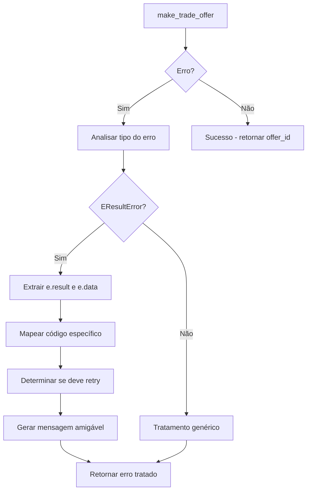

# 🔍 SISTEMA DE TRATAMENTO DE ERROS AIOSTEAMPY

## Visão Geral
Este documento explica como o sistema de tratamento de erros específicos do **aiosteampy** foi implementado, focando na captura e análise de erros `EResultError` da Steam API.

## 🎯 Problema Original

Quando o aiosteampy falha ao enviar uma trade offer, ele pode lançar exceções específicas do tipo `EResultError` que contêm informações valiosas sobre o erro da Steam:

```python
try:
    offer_id = await client.make_trade_offer(...)
except Exception as e:
    # ❌ ANTES: Apenas str(e)
    print(f"Erro: {str(e)}")
    
    # ✅ DEPOIS: Análise detalhada
    print(f"e.result: {e.result}")      # Código específico da Steam
    print(f"e.data: {e.data}")          # Dados adicionais
```

## 🔧 Implementação

### 1. Wrapper de Análise de Erro

Em `services/aiosteampy_service.py`, adicionamos um wrapper específico na função `enviar_oferta_aiosteampy`:

```python
try:
    offer_id = await client.make_trade_offer(...)
    
except Exception as make_offer_error:
    # 🔍 ANÁLISE DETALHADA DO ERRO
    print(f"❌ ERRO DETALHADO em make_trade_offer:")
    print(f"   • Tipo: {type(make_offer_error).__name__}")
    print(f"   • Mensagem: {str(make_offer_error)}")
    
    # Verificar propriedades específicas do aiosteampy
    if hasattr(make_offer_error, 'result'):
        print(f"   • e.result: {make_offer_error.result}")
    if hasattr(make_offer_error, 'data'):
        print(f"   • e.data: {make_offer_error.data}")
    if hasattr(make_offer_error, 'code'):
        print(f"   • e.code: {make_offer_error.code}")
    if hasattr(make_offer_error, 'response'):
        print(f"   • e.response: {make_offer_error.response}")
```

### 2. Função de Mapeamento de Códigos

Criamos uma função específica para mapear códigos de erro da Steam:

```python
def map_steam_error_code(error_obj) -> dict:
    """
    Mapeia códigos de erro específicos da Steam para mensagens amigáveis
    """
    error_mapping = {
        "EResult.Fail": {
            "message": "Steam rejeitou a operação (falha genérica)",
            "retry_suggested": True
        },
        "EResult.Invalid": {
            "message": "Parâmetros inválidos enviados para a Steam",
            "retry_suggested": False
        },
        "EResult.Timeout": {
            "message": "Steam demorou para responder (timeout)",
            "retry_suggested": True
        },
        "EResult.Busy": {
            "message": "Steam está temporariamente sobrecarregada", 
            "retry_suggested": True
        },
        "EResult.RateLimitExceeded": {
            "message": "Rate limit atingido - muitas requisições",
            "retry_suggested": False
        },
        # ... mais códigos
    }
```

### 3. Tratamento Específico por Tipo de Erro

```python
# 🔍 TRATAMENTO ESPECÍFICO PARA EResultError DO AIOSTEAMPY
if hasattr(trade_error, 'result') or hasattr(trade_error, 'code'):
    try:
        # Usar função de mapeamento para códigos específicos
        error_info = map_steam_error_code(trade_error)
        
        print(f"🔍 STEAM ERROR ANALYSIS:")
        print(f"   • Código: {error_info['code']}")
        print(f"   • Mensagem: {error_info['message']}")
        print(f"   • Retry sugerido: {error_info['retry_suggested']}")
        
        # Construir mensagem de erro específica
        detailed_message = f"Steam Error: {error_info['message']}"
        if hasattr(trade_error, 'data') and trade_error.data:
            detailed_message += f" | Dados: {trade_error.data}"
            
        raise RuntimeError(detailed_message)
```

## 📋 Códigos de Erro Mapeados

| Código Steam | Significado | Retry Sugerido | Ação Recomendada |
|--------------|-------------|----------------|------------------|
| `EResult.Fail` | Falha genérica | ✅ Sim | Tentar novamente após delay |
| `EResult.Invalid` | Parâmetros inválidos | ❌ Não | Verificar dados enviados |
| `EResult.Timeout` | Timeout da Steam | ✅ Sim | Tentar novamente |
| `EResult.Busy` | Steam sobrecarregada | ✅ Sim | Aguardar e tentar novamente |
| `EResult.RateLimitExceeded` | Rate limit atingido | ❌ Não | Aguardar 30+ minutos |
| `EResult.AccessDenied` | Acesso negado | ❌ Não | Verificar permissões |
| `EResult.NotLoggedOn` | Não logado | ✅ Sim | Refazer login |

## 🚀 Benefícios

### 1. **Debugging Melhorado**
- Logs detalhados com códigos específicos da Steam
- Informações sobre `e.result`, `e.data`, `e.code`
- Distinção entre erros temporários e permanentes

### 2. **Retry Inteligente**
- Decisão automática sobre quando tentar novamente
- Evita retries desnecessários em erros permanentes
- Melhora a experiência do usuário

### 3. **Mensagens de Erro Claras**
- Explicações amigáveis dos códigos de erro
- Informações sobre próximos passos
- Distinção entre problemas da Steam vs. problemas da aplicação

## 📊 Exemplo de Log Melhorado

**ANTES:**
```
❌ Erro ao criar oferta: Request failed with status 500
```

**DEPOIS:**
```
❌ ERRO DETALHADO em make_trade_offer:
   • Tipo: EResultError
   • Mensagem: Request failed with status 500
   • e.result: EResult.Busy
   • e.data: {"message": "Steam servers are currently overloaded"}
   
🔍 STEAM ERROR ANALYSIS:
   • Código: EResult.Busy
   • Mensagem: Steam está temporariamente sobrecarregada
   • Retry sugerido: True
```

## 🔄 Fluxo de Tratamento



## 📚 Referências

- [Documentação aiosteampy](https://github.com/someuser/aiosteampy)
- [Steam Web API Documentation](https://developer.valvesoftware.com/wiki/Steam_Web_API)
- [EResult Codes Reference](https://steamcommunity.com/dev)

---

**Implementado em**: `services/aiosteampy_service.py`  
**Data**: 31/07/2025  
**Versão**: 1.0
